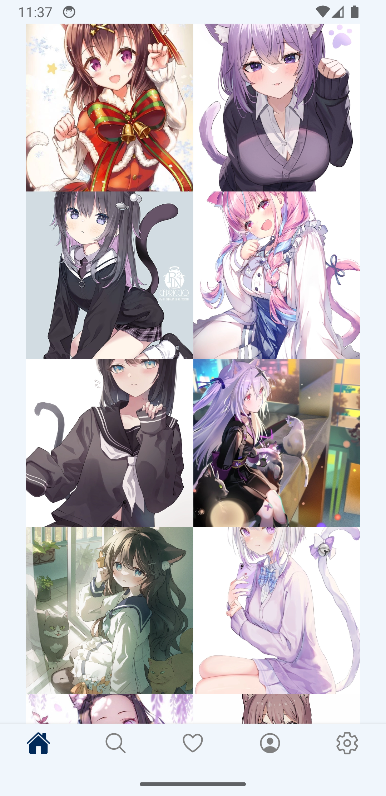
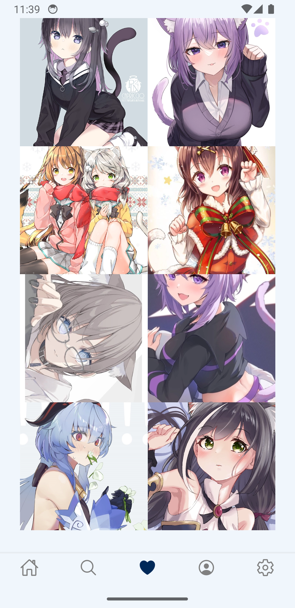
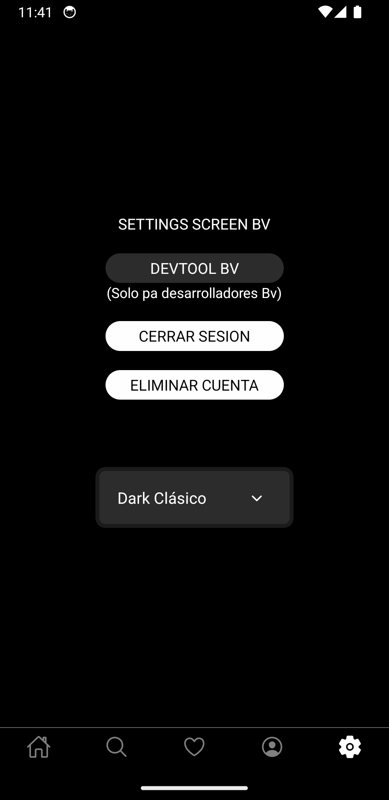
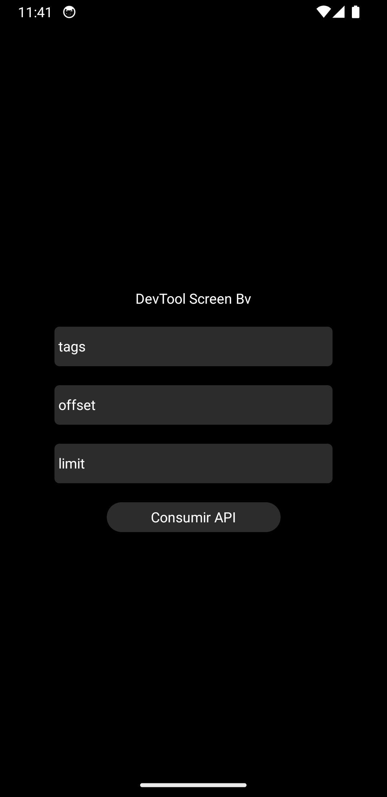
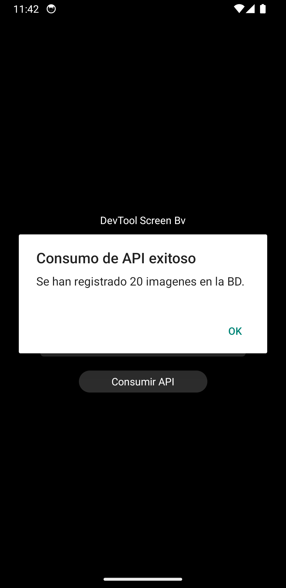
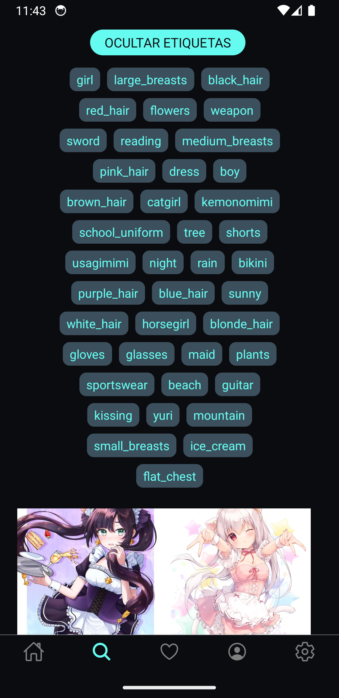

# 📱 NekoPaper

> Aplicación móvil desarrollada en React Native para explorar wallpapers de personajes estilo anime consumiendo NekosAPI (API de terceros), con sistema de usuarios, favoritos y backend propio en PHP + MySQL.


---

## 📱 Descripción

**NekoPaper** es una aplicación móvil desarrollada en React Native + TypeScript (Expo) con backend en PHP y MySQL, enfocada en la exploración y filtrado seguro de wallpapers anime mediante integración de una API externa (NekosAPI) y procesamiento propio de contenido.

La aplicación implementa un sistema de procesamiento de wallpapers, almacenamiento optimizado y filtrado automático basado en etiquetas, permitiendo una experiencia rápida y segura para el usuario final.

El proyecto fue desarrollado como una aplicación full stack experimental para explorar integración de APIs externas, procesamiento de datos, arquitectura cliente-servidor y despliegue de backend en producción.

---

## 📸 Capturas

<table>
<tr>
<td align="center">
<b>Galería Principal</b><br>

</td>

<td align="center">
<b>Favoritos</b><br>

</td>

<td align="center">
<b>Settings</b><br>

</td>
</tr>

<tr>
<td align="center">
<b>Panel Consumo API</b><br>

</td>

<td align="center">
<b>Consumo API</b><br>

</td>

<td align="center">
<b>Búsqueda por Etiquetas</b><br>

</td>
</tr>
</table>

> Puedes ver más capturas dentro de la carpeta `/screenshots`.

---

## ✨ Características principales

### Técnicas

- 📡 Integración de NekosAPI 
- 🧩 Arquitectura modular usando:
    - Custom Hooks
    - Context API
    - Componentes reutilizables
- 🔐 Filtrado automático de contenido mediante etiquetas y lista negra
- 🛡️ Manejo de credenciales fuera del cliente
- 🌐 Backend desplegado con endpoints propios para administración de contenido

### Funcionales

- 📱 APK instalable para Android
- 🎭 Wallpapers de personajes estilo anime
- ⭐ Sistema de favoritos
- 👤 Registro e inicio de sesión
- 🎨 Temas visuales para la interfaz
- 🛠️ Panel para consumo de API privado

---

## 🛠️ Tecnologías utilizadas

### Frontend móvil

- React Native
- TypeScript
- Expo CLI

### Backend

- PHP
- MySQL

### Infraestructura

- Hostinger
- Hosting y Base de Datos en dominio propio

### Herramientas

- VS Code
- Android Studio
- Postman

---

## 📊 Estadísticas del proyecto

| Métrica               | Valor                               |
| --------------------- | ----------------------------------- |
| Pantallas             | 9                                   |
| Endpoints backend     | 14                                  |
| Tamaño APK            | ~70 MB                              |
| Wallpapers procesados | +200                                |
| Etiquetas registradas | +50                                 |
| Etiquetas censuradas  | 10 (lista negra)                    |
| Arquitectura          | Cliente-Servidor / API REST modular |

---

## 🧠 Arquitectura del proyecto

NekoPaper utiliza una arquitectura cliente-servidor, combinando una API externa de wallpapers anime con un backend propio encargado de procesamiento, almacenamiento y filtrado seguro de contenido.

```text
   NekosAPI 
      ↓ 
   Backend propio (PHP) 
      ↓ 
   MySQL Database 
      ↓ 
   Validación de contenido seguro 
      ↓ 
   React Native App
```

La aplicación implementa una estructura modular separando responsabilidades entre:

- Frontend móvil (React Native + TypeScript) para interfaz, navegación y experiencia de usuario.
- API REST en PHP para autenticación, usuarios, favoritos y contenido.
- Base de datos MySQL para persistencia de información.

El backend está organizado mediante una estructura modular basada en endpoints y clases PHP, separando funcionalidades por dominio (usuarios, autenticación, wallpapers y favoritos), facilitando mantenimiento y escalabilidad del proyecto.

---

## Flujo de procesamiento de contenido

El sistema obtiene información de wallpapers desde NekosAPI, almacenando metadatos relevantes dentro de una base de datos propia para optimizar tiempos de carga y centralizar la lógica de negocio.

Antes de mostrar contenido dentro de la aplicación, el backend realiza un proceso de validación basado en:

- 🔞 Clasificación de seguridad del contenido (safe, explicit, etc.)
- 🏷️ Sistema de etiquetas censuradas (blacklist) administrado desde base de datos
- 🚫 Exclusión automática de wallpapers con etiquetas no permitidas
- 🧩 Prevención de contenido duplicado al sincronizar información desde la API externa

Esto permite que únicamente se muestre contenido considerado seguro dentro de la aplicación.

### Beneficios de la arquitectura
- ⚡ Optimización de carga mediante almacenamiento local de datos
- 🧩 Centralización de la lógica de filtrado y moderación
- 🔐 Evita exponer directamente APIs o lógica sensible al cliente
- 📦 Menor dependencia directa de servicios externos desde la app
- 🛡️ Mayor control sobre el contenido disponible al usuario

---

## ⚙️ Configuración del proyecto

Por motivos de seguridad, las credenciales del backend y conexión a base de datos **no se encuentran incluidas dentro del repositorio**.

El proyecto utiliza:

- ⚙️ Backend propio en **PHP**
- 🗄️ **MySQL** alojado remotamente
- 🔐 Variables privadas para conexión
- 🌐 Endpoints personalizados para autenticación y contenido

Las capturas, estructura del proyecto y devlogs muestran el funcionamiento general de la aplicación.

---

## 📦 APK

Puedes descargar una build de demostración de la aplicación para Android:

📱 **APK:** _[Descarga directa APK](https://mudisdev.com/releases/NekoPaper.apk)_

⚠️ Nota: Esta APK corresponde a una versión de prueba exportada para fines de demostración técnica y portafolio.<br>
Algunas características relacionadas con optimización, seguridad y experiencia final de usuario continúan en desarrollo.<br>
La build permite visualizar el funcionamiento general de la aplicación, incluyendo frontend móvil, autenticación, backend desplegado y conexión a base de datos remota.

---

## 🎥 Devlogs

El desarrollo ha sido documentado públicamente como parte de mi proceso de aprendizaje y construcción de producto.

- 🎬 **Devlog #1** _[Enlace directo a YouTube](https://www.youtube.com/watch?v=5_CQwyKyqgo)_

---

## 🔮 Futuras mejoras

- 🐞 Corrección de bugs en pantallas específicas
- 🔒 Mejoras en la lógica de censura
- 🔒 Mejoras en seguridad de datos
- 🚀 Reducir peso del APK
- ✨ Optimizar carga de listas
- 🏁 App experimental finalizada

---

## 👨‍💻 Autor

**Martín Bibiano (MudisDev)**

📧 Email: [devgames.studio4@gmail.com](mailto:devgames.studio4@gmail.com)
💼 Portfolio: _[mudisdev.com](https://mudisdev.com)_
🐙 GitHub: _[github.com/MudisDev](https://github.com/MudisDev)_

---

## ⚠️ Estado del Proyecto

NekoPaper se considera una aplicación funcional y parcialmente finalizada, con sus características principales implementadas y backend desplegado en producción.

Actualmente el proyecto se encuentra en fase de mantenimiento y mejora continua, recibiendo optimizaciones de rendimiento, seguridad, estabilidad y refinamiento de arquitectura como parte del proceso de evolución del producto.